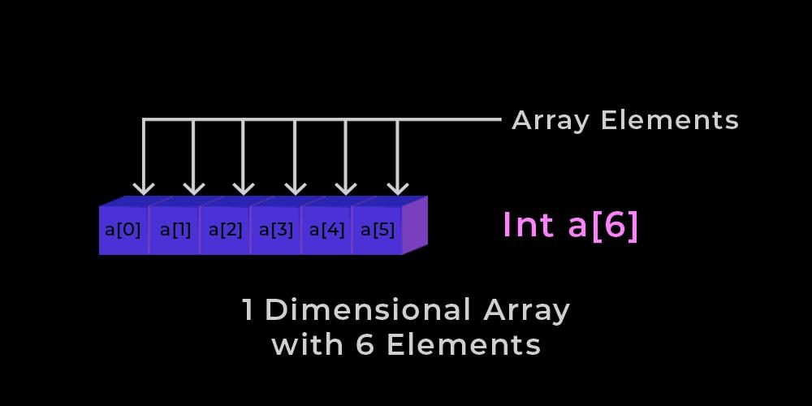
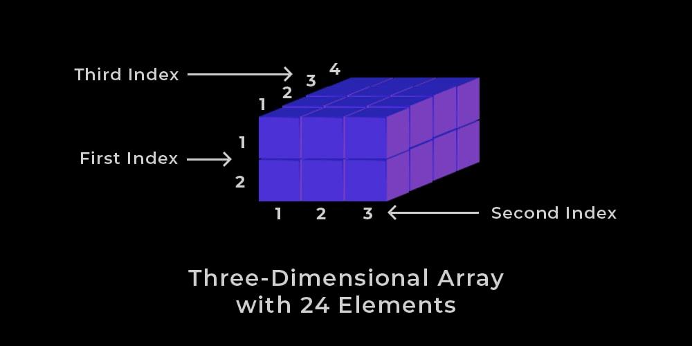

# Week 4
## Calculating the Memory Address of an element

### One-Dimensional Arrays
- Definition:
  * Also known as 1-D arrays.
  * Are a type of a linear array where the elements are accessed using a single index.
  * The index, represents either a row or column position in the array.
- Formula:
  * **One-Dimensional Array Formula**
    $$Address[Index] = B + W * (Index - LB)$$
  * Where:
    + _Address_ 
      - Is the Address of the element in the array.
    + _Index_ 
      - Is the position of the element being calculated.
      - Not the element's actual value, only the address.
    + _B_
      - The base address of the array.
      - Or the starting memory address of the array in memory.
    + _W_
      - The storage size of each element in bytes.
      - Different data types have different sizes.
    * _LB_
       - The lower bound value.
       - Default value is 0 if not specified.
- Example:
  * Assume an array A[500..800] with:
    + B = 2000
    * W = 4 bytes
    * LB = 500
  * What is the address of A[750]?
  * Solution:
  ```
    Address of A[750] = 2000 + 4 * (750 - 500)
                      = 2000 + 4 * (250)
                      = 2000 + 1000
                      = 3000
  ```
- Diagram:
   

### Two-Dimensional Arrays
- Definition:
  * Also known as 2-D arrays, or array of arrays.
  * Similar to a Matrix, with its grid-like structure—with rows and columns having their own elements.
  * It is specified by using two subscripts:
    + Row size
    + Column size
  * There are two ways to calculate the memory address of a 2-D array element.
- Diagram
  | Array | col 0 | col 1 | col 2 |
  |---|---|---|---|
  | row 0 | a[0][0] | a[0][1] | a[0][2] |
  | row 1 | a[1][0] | a[1][1] | a[1][2] |
  | row 2 | a[2][0] | a[2][1] | a[2][2] |
- __2-D Row Major Order__
  * Definition
    + In this type of 2-D array, the elements of an array are stored in one row at a time.
    + Meaning, all the elements in the first row are stored first in memory, then all the elements in the second row, and so on.
    * The elements are __horizontally linear__ in memory.
  * Formula:
    + __Two Dimensional Row Major Order Formula__
      $$Address[I][J] = B + W * {(I - LR) * N + (J - LC)}
    + Where:
      - _Address_ 
        * Is the Address of the element in the array.
      - _I_
        * Row number of the element being calculated.
      - _J_
        * Column number of the element being calculated.
      - _B_
        * The base address of the array.
        * Or the starting memory address of the array in memory. 
      - _W_
        * The storage size of each element in bytes.
        * Different data types have different sizes.
      - _LR_
        - Lower Limit of Row or Starting Row Index.
        - Default value is 0 if not specified.
      - _LC_
        - Lower Limit of Column or Starting Column Index.
        - Default value is 0 if not specified.
      - _N_
        - The total number of columns in the array
        - Formula:
          $$UC - LC + 1$$
  + Example:
    - Given an array, A[2..12][3..18] with a base address of 200 and each element having a size of 2 bytes in memory, find the address of A[10][5] using row-major order.
      * A[2..12][3.18] means rows ranging from 2 to 12 and columns ranging from 3 to 18.
      * Given:
        + B = 200
        + W = 2 bytes
        + I = 10
        + J = 5
        + LR = 2
        + LC = 3
        + N = 16
    - Solution:
    ```
         A[I][J] = B + W * {(I - LR) * N + (J - LC)}
        A[10][5] = 200 + 2 * {(10 - 2) * 16 + (5 - 3)}
                 = 200 + 2 * {(8) * 16 + (2)}
                 = 200 + 2 * {128 + (2)}
                 = 200 + 2 * {130}
                 = 200 + 260
                 = 460
    ```
- __2-D Column Major Order__
  * Definition:
    + In this type of 2-D array, the elements of an array are stored in one column at a time.
    + Meaning, all the elements in the first column are stored first in memory, then all the elements in the second column, and so on.
    * The elements are __vertically linear__ in memory.
  * Formula:
    + __Two Dimensional Column Major Order Formula__
      $$Address[I][J] = B + W * {(J - LC) * N + (I - SR)}
    + Where:
      - _Address_ 
        * Is the Address of the element in the array.
      - _I_
        * Row number of the element being calculated.
      - _J_
        * Column number of the element being calculated.
      - _B_
        * The base address of the array.
        * Or the starting memory address of the array in memory. 
      - _W_
        * The storage size of each element in bytes.
        * Different data types have different sizes.
      - _LR_
        - Lower Limit of Row or Starting Row Index.
        - Default value is 0 if not specified.
      - _LC_
        - Lower Limit of Column or Starting Column Index.
        - Default value is 0 if not specified.
      - _N_
        - The total number of rows in the array
        - Formula:
          $$UR - LR + 1$$
  + Example:
    - Given an array, A[2..12][3..18] with a base address of 200 and each element having a size of 2 bytes in memory, find the address of A[10][5] using column-major order.
      * A[2..12][3.18] means rows ranging from 2 to 12 and columns ranging from 3 to 18.
      * Given:
        + B = 200
        + W = 2 bytes
        + I = 10
        + J = 5
        + LR = 2
        + LC = 3
        + N = 11
    - Solution:
    ```
         A[I][J] = B + W * {(J - LC) * N + (I - LR)}
        A[10][5] = 200 + 2 * {(5 - 3) * 11 + (10 - 2)}
                 = 200 + 2 * {(2) * 11 + (8)}
                 = 200 + 2 * {22 + (8)}
                 = 200 + 2 * {30}
                 = 200 + 60
                 = 260
    ```

### Three Dimensional Arrays
- Definition
  * Is a collection of 2-D arrays.
  * It is specified by using three subscripts
    + Block size
    + Row size
    + Column Size
  * More dimensions in an array means more data can be stored in that array.
  * There are two ways to find the address in a 3-D array
- __3-D Row Major Oder__
  * Definition:
    + The elements of a 3-D array are stored one row at a time within each block.
    + Once all of the rows in a block are stored (or filled), it moves on to the next block.
  * Formula:
    + __Three Dimensional Row Major Order Formula__
      $$Address[i][j][k] = Base * Size * {P * N * (i - x) + P * (j - y) + (k - z)}$$
    + Where: 
      - _Address_ 
        * Is the Address of the element in the array.
      - _i_
        * Row number of the element being calculated.
      - _j_
        * Column number of the element being calculated.
      - _k_
        * Block number of the element being calculated.
      - _B_
        * The base address of the array.
        * Or the starting memory address of the array in memory. 
      - _W_
        * The storage size of each element in bytes.
        * Different data types have different sizes.
      - _x_
        - Lower Limit of Row or Starting Row Index.
        - Default value is 0 if not specified.
      - _y_
        - Lower Limit of Column or Starting Column Index.
        - Default value is 0 if not specified.
      - _z_
        - Lower Limit of Block or Starting Block Index.
        - Default value is 0 if not specified.
      - _M_
        - The total number of rows in the array
        - Formula:
          $$UR - LR + 1$$
      - _N_
        - The total number of columns in the array
        - Formula:
          $$UC - LC + 1$$
      - _P_
        - The total number of blocks (depth-based) in the array
        - Formula:
          $$UB - LB + 1$$
  * Example:
    + Given a 3-D array with A[3..7][-2..2][0..4] with:
      - B = 500
      - W = 3 bytes
    + Find the address of [6][0][3] using row-major order.
    + Given:
      - B = 500
      - S = 3 bytes
      - x = 3
      - y = -2
      - z = 0
      - M = 5
      - N = 5
      - P = 5
      - i = 6
      - j = 0
      - k = 3
    + Solution:
    ```
        A[i][j][k] = Base + Size * {5 * N * (i - x) + 5 * (j - y) + (k - z)}
        A[6][0][3] = 500 + 3 * {5 * 5 * (6 - 3) + 5 * (0 - -2) + (3 - 0)}
                   = 500 + 3 * {5 * 5 * (3) + 5 * (2) + (3)}
                   = 500 + 3 * {25 * (3) + 5 * (2) + (3)}
                   = 500 + 3 * {75 + 5 * (2) + (3)}
                   = 500 + 3 * {75 + 10 + (3)}
                   = 500 + 3 * {85 + (3)}
                   = 500 + 3 * {88}
                   = 500 + 264
                   = 764
    ```
    <!-- wth is this? got it in my first try -->
- __3-D Row Major Oder__
  * Definition:
    + The elements of a 3-D array are stored one column at a time within each block.
    + Once all of the columns in a block are stored (or filled), it moves on to the next block.
  * Formula:
    + __Three Dimensional Column Major Order Formula__
      $$Address[i][j][k] = Base * Size * {M * P * (k - z) + M * (j - y) + (i - x)}$$
    + Where: 
      - _Address_ 
        * Is the Address of the element in the array.
      - _i_
        * Row number of the element being calculated.
      - _j_
        * Column number of the element being calculated.
      - _k_
        * Block number of the element being calculated.
      - _B_
        * The base address of the array.
        * Or the starting memory address of the array in memory. 
      - _W_
        * The storage size of each element in bytes.
        * Different data types have different sizes.
      - _x_
        - Lower Limit of Row or Starting Row Index.
        - Default value is 0 if not specified.
      - _y_
        - Lower Limit of Column or Starting Column Index.
        - Default value is 0 if not specified.
      - _z_
        - Lower Limit of Block or Starting Block Index.
        - Default value is 0 if not specified.
      - _M_
        - The total number of rows in the array
        - Formula:
          $$UR - LR + 1$$
      - _N_
        - The total number of columns in the array
        - Formula:
          $$UC - LC + 1$$
      - _P_
        - The total number of blocks (depth-based) in the array
        - Formula:
          $$UB - LB + 1$$
  * Example:
    + Given a 3-D array with A[2..6][-3..1][1..5] with:
      - B = 600
      - W = 4 bytes
    + Find the address of [5][0][4] using column-major order.
    + Given:
      - B = 600
      - S = 4 bytes
      - x = 2
      - y = -3
      - z = 1
      - M = 5
      - N = 5
      - P = 5
      - i = 5
      - j = 0
      - k = 4
    + Solution:
    ```
        Address[i][j][k] = Base * Size * {M * P * (k - z) + M * (j - y) + (i - x)}
        Address[5][0][4] = 600 * 4 * {5 * 5 * (4 - 1) + 5 * (0 - -3) + (5 - 2)}
                         = 600 * 4 * {5 * 5 * (3) + 5 * (3) + (3)}
                         = 600 * 4 * {25 * (3) + 5 * (3) + (3)}
                         = 600 * 4 * {75 + 5 * (3) + (3)}
                         = 600 * 4 * {75 + 15 + (3)}
                         = 600 * 4 * {90 + (3)}
                         = 600 * 4 * {93}
                         = 600 * 372
                         = 972
    ```
- Diagram:
   