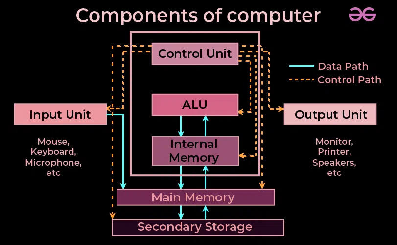
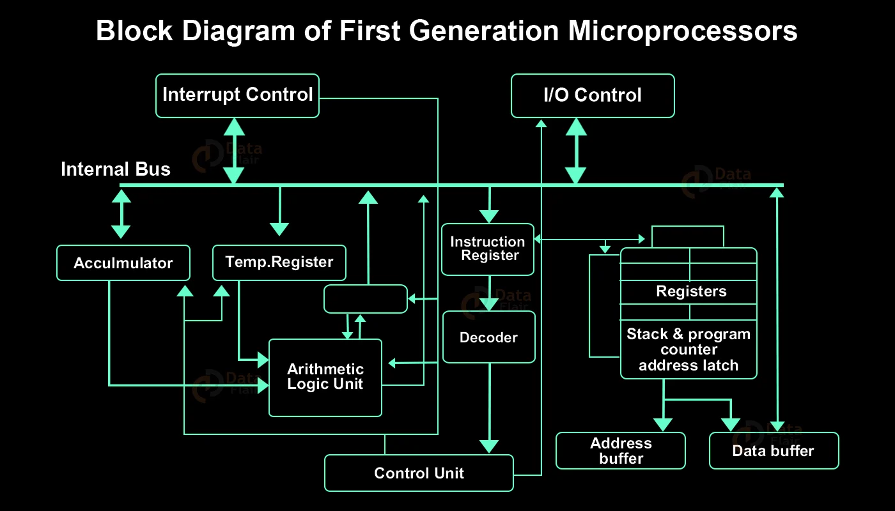
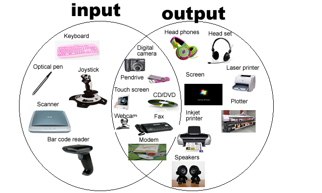
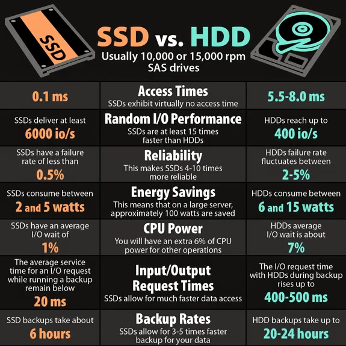
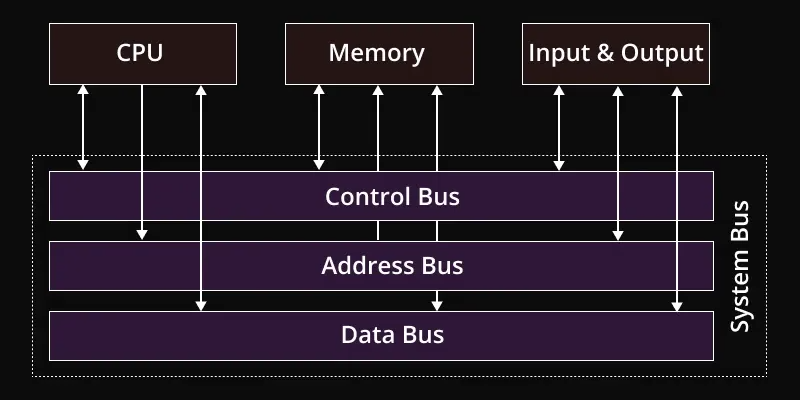

# Topic 3 & 4
- Learning Outcomes
  * Identify the main components of a computer system, including the Central Processing Unit (CPU), memory (RAM), input/output devices, storage devices, and buses.
  * Explain, describe, or identify the function of the computer components in the overall operation of a computer system. 
  * Explain the importance of standards in computing and their role in ensuring interoperability, consistency, and innovation.
  *  Identify key computer organization standards and describe their impact on the development and compatibility of computer systems.
- Topics
  3. Introduction to Computer Components
    + 3.1.Central Processing Unit (CPU)
    + 3.2.Memory (RAM)
    + 3.3.Input and Output Devices
    + 3.4. Storage Devices
    + 3.5.Buses (Data Pathways)
  4. Introduction to Standard Organizations
    + 4.1.Importance of Standards in Computing
    + 4.2.Computer Organization Standards
    + 4.3. Strengths of Standard Organizations
    + 4.4.Weaknesses and Challenges

## Introduction to Computer Components
- Background
  + The foundational components of a computer are essential for understanding its operations and functionalities. This lecture will intoduces key elements that make up a computer system; the Central Processing Unit (CPU), Memory (RAM), Input and Output Devices, Storage Devices, and Buses (Data Pathways).
  + Each componnet is crucial to the computer's ability to process data, store information, and interact with users. 
  + By understanding these components, certain insight will be gained into how computers perform tasks, manage resources, and support various applications.
- Diagram
  

### Central Processing Unit (CPU)
- Definition:
  * The _CPU_ is often called the "__brain__" of the computer, as it is __responsible for executing instructions, performing calculations, and managing data__ flow within the system.
  * It is a _complex microprocessor_ composed of __millions of transistors__, and it plays a __central role in the functioning__ of the computer.
- It has three main parts:
  1. __Arithmetic Logic Unit__ (_ALU_)
    + Definition: 
      - The _ALU_ is the _CPU_ component that __performs all arithmetic operations__—_Addition, Subtraction, Multiplication, and Division_—and logical operations, such as comparisons like _significant than, less than or equal to_.
      - It is crucial for __processing numerical data__ and __making decisions baed on logic__.
    + Example:
      - When a program requires calculation, such as adding two numbers, the ALU performs the operation and stores the result in a register or memory location for future use.
  2. __Control Uunit__ (CU)
    + Definition:
      - The _CU_ directs the _CPU_'s operarions by __controlling the data flow__ between the __CPU, memory, and input/output devices__.
      - It __fetches instructions__ from memory, __decodes them__ to determine the required actions, and the __executes them__ by the _ALU_ and other components.
    + Example:
      - If a program instructs the computer to read data from memory, the _CU_ fetches the instruction, decodes it to understand that data needs to be read, and the sends signals to the appropriate components for the operation.
  3. __Registers__
    + Definition:
      - _Registers_ are __small, fast storage locations__ within the _CPU_ that __temporarily hold data and instructions__ that are being processed.
      - It plays a vital role in the _CPU_'s ability to __quickly access__ and __manipulate data__, aloowing for efficient execution of instructions.
    + Example:
      - When calculating, the CPU may store intermediate results in registers to speed up the process and reduce the need to access slower memory location
- Diagram:
  

### Memory
- Definition:
  * __Random Access Memory__ (_RAM_) is the computer's __short-term memory__, used to __store data actively being processed__ by the CPU.
  * _RAM_ is __volatile__, meaning it loses all stored data when the power is turned off.
  * The __speed__ and __capacity__ of _RAM_ directly __influence the computer's performance__, as it determinces how quickly the _CPU_ can access data and how much data can be processed simultaneosuly.
  * When an application is opened, the operating system loads the application's data and code into _RAM_, allowing the _CPU_ to access and execute the necessary instructions quickly.
  * If the RAM is complete (full), the system may slow down, as it has to rely on slower storage devices (swaps or pagefiles) to store overflow data.
- It has two types:
  * __Dynamic Random Access Memory__ (_DRAM_)
    + The __most common type__ of _RAM_, used in most computers and devices.
    + _DRAM_ needs to be __refreshed thousands of times per second__, as it __stores each bit of data in a tiny capacitor__.
  * __Static Random Access Memory__ (_SRAM_)
    + __Faster and more expensive__ than _DRAM_, used for __cache memory, providing high-speed CPU data access__.
  
### Input & Output Devices
- Definition
  * __Input and Output (_I/O_) Devices__ are the __peripherals that allow users to interact__ with the computer, enabling __data input and output__, __to and from the system__.
- __Input Devices__
  * Definition
    + __Converts user actions into data__ that the computer can process.
    + These devices include __keyboards, mice, scanners, microphones, cameras__, etc.
    + They are __essential for entering data, controlling applications, and providing instructions__ to the computer.
  * Example:
    + When typing a document, each keystroke on the keyboard is converted into digital signals that the _CPU_ can process, displaying the corresponding character on the screen.
- __Output Devices__
  * Definition
    + __Converts processed data from the computer into a from that users can understand or interact with__.
    * Typical output devices include __monitors__ for visual display, __printers__ for physical copies of documents, and __speakers__ for audio output.
  * Example:
    + After typing a document, a printer might be used. The _CPU_ sends the processed data to the printer, procuding a physical document copy.
- Diagram:
 
<!-- i hate light mode huhuhu -->

### Storage Devices
- Definition:
  * Are responsible for __holding data permanently or semi-permanently__, ensuring tha information can be __retained even when the computer is powered off__.
  * _Storage devices_ __vary in speed, capacity, and technology__.
- Types of Storage Devices:
  * __Hard Disk Drives__ (_HDDs_)
    + Uses __magnetic storage__ to read and write data on __spinning disks__ (_platters_).
    + They offer ample storage capabilities at a __lower costs__ but are __slower__ than newer technologies.
    > An operating system and most files, such as documents, photos, and videos, are typically stored on an HDD.
  * __Solid-State Disks__ (_SSDs_)
    + Uses __flash memory__ to store data providing __faster access and excellent reliability than HDDs__.
    + _SSDs_ have __no moving parts__, which make the more __durable and energy-efficient__, but they are usualle __more expensive__ per gigabyte.
    > An SSD often stores the operating system and frequently accessed applications, significantly speeding up boot and program loading times.
  * __Optical Drives__ (_CDs_, _DVDs_, _Blu-rays_)
    + Uses __lasers__ to read and write data on __disks__, such as _Compact Disks, Digital Video Disks_, and _Blu-rays_.
    + Altough __less common__ today due to digital distribution, there are still __used for installing software, playing media, and archiving data__.
    > When you install a program from a DVD, the optical drive reads the data from the disc and transfers it to your computer’s storage. 
  * __Flash Devices__
    + Are __portable storage devices__ that use __flash memory__, making them ideal for __transferring files between computers__.
    + They are __small, durable__, and __do not require external power sources__.
    > You might use a flash drive to carry important documents or presentations that you need to access on different computers.
- Diagram:
 

### Buses (Data Pathways)
- Definition
  * Are __communication pathways__ that __connect computer components__, allowing them to __communicate and transfer data efficiently__.
- Types of Buses:
  * __Data Bus__
    + Carries __actual data between the CPU, memory, and other peripherals__.
    + The width of the data bus — the number of bits that it can carry — affects the amount of data that can be transfered simultaneously.
    >  When the CPU reads data from memory, the data bus transfers the data from the memory to the CPU for processing.
  * __Address Bus__
    + Carries __memory addresses__, which specify the __location in memory where data should be read from or written to__.
    + Unlike the data bus, the address bus typically only transfers memory addresses.
    > When the CPU needs to access data stored in a specific memory location, it sends the address of that location over the address bus.
  + __Control Bus__
    + Carries __control signals__ that __manage the operations__ across the computer's components.
    + This signals __coordinate activities__ like reading from memory, writing to memory, and responding to input devices.
    > During a memory read operation, the control bus sends signals that trigger the memory to place the requested data onto the data bus for the CPU to read.
- Diagram:
 

## Introduction to Standard Organizations

### Importance of Standards in Computing

### Computer Organization Standards

### Strengths of Standard Organizations

### Weakneses and Challenges